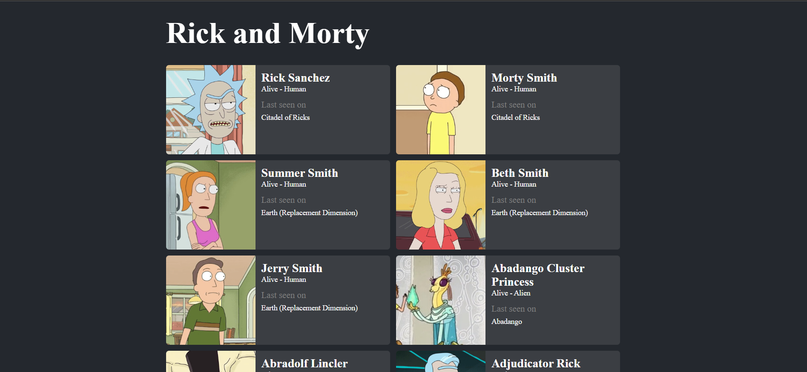

# Rick and Morty Character Viewer



## Description

The Rick and Morty Character Viewer is a simple web application that utilizes the Rick and Morty API to display characters from the show along with some details about them. This project was built using React and React Query, making it easy to fetch and display character data from the API.

This was my first time working with APIs and my first project with it. You can use this as a template for your other simple API related projects.

This [video](https://youtu.be/NQULKpW6hK4?si=_IPgS47bLcCCLu0N
) properly explains what the code does exactly and is what I used to make this project.

It is super easy to follow as long as you know basic Java Script.

Enjoy!


## Features

- View a list of Rick and Morty characters.
- See details of the characters eg: dead or alive.
- Smooth and efficient data fetching with React Query.
- Paginations for seeing other characters
- Responsive design.


## Technologies
- React
- React Query
- HTML
- CSS

## Docs
For more info on the Rick and Morty API visit their site:
https://rickandmortyapi.com/

For more info on React Query visit their site:
https://tanstack.com/query/latest/docs/react/overview

## Installation

To run this project locally, follow these steps:

1. Clone this repository to your local machine:

```bash
git clone https://github.com/Battlearmour2000/rick-and-morty
```

2. Navigate to the project directory:
    
```bash
cd rick-and-morty-character-viewer
```
3. Install the required dependencies:
```bash
npm install
```
4. Start the development server
```bash
npm start
```

5. Open your web browser and access the application at http://localhost:3000.


## Contact
If you have any questions or suggestions, feel free to reach out to me at vishani.mj@gmail.com.

### Thank you and hope you have fun!
